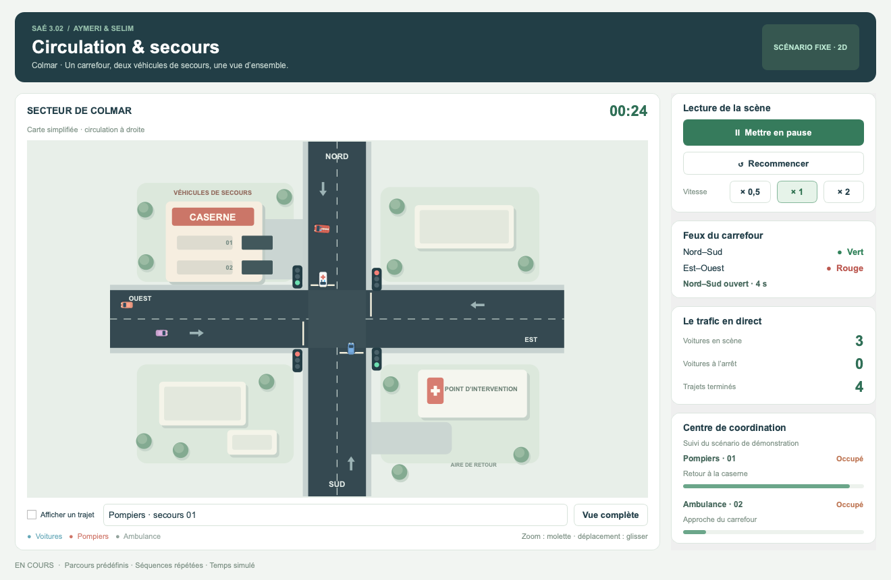

# SAE302 — Facture Sucrée

Simulation de trafic à Colmar, réalisée par **Aymeri et Selim** pour la SAÉ 3.02 du BUT Réseaux & Télécommunications.

## Version actuelle : interface graphique et animation 2D

Cette version affiche une carte simplifiée, un carrefour à quatre branches, la caserne, des bâtiments et les feux. Huit trajets de voitures sont prédéfinis : les véhicules avancent, attendent, tournent à gauche ou à droite et quittent la scène. Deux véhicules de secours suivent chacun un parcours de démonstration, avec des gyrophares animés et un retour à la caserne.

L’interface comprend :

- lancement, pause, reprise et réinitialisation ;
- vitesses ×0,5, ×1 et ×2 ;
- zoom, déplacement de la carte et retour à la vue complète ;
- affichage du trajet choisi ;
- temps simulé, voitures présentes, voitures à l’arrêt et trajets terminés ;
- état distinct **disponible / occupé** et progression de chaque secours.



Les déplacements et les attentes sont inscrits dans une chronologie fixe. Les feux illustrent un cycle de 8 s de vert, 1 s d’orange et 1 s de rouge simultané. **Aucune génération aléatoire, décision de priorité, détection de collision en temps réel ou communication réseau n’est encore implémentée.** Les états affichés par le centre de coordination sont ceux du scénario local. Les horaires ont été préparés pour éviter les chevauchements dans cette démonstration.

Le [cahier des charges](docs/Cahier_des_charges_SAE302.pdf) reste la référence pour la simulation complète. Le [guide de l’interface et l’ordre de développement](docs/interface.md) expliquent cette étape et la suite du projet.

## Récupérer le projet

```bash
git clone https://github.com/aymbrique/SAE-3.02--D-velopper-une-application-communicante.git SAE302-Facture-Sucree
cd SAE302-Facture-Sucree
```

## Installation

Prérequis : **Python 3.13**. PyCharm peut être utilisé sur les deux ordinateurs.

### macOS / Linux

```bash
python3.13 -m venv .venv
source .venv/bin/activate
python -m pip install -r requirements.txt
python main.py
```

### Windows — PowerShell

```powershell
py -3.13 -m venv .venv
.\.venv\Scripts\python.exe -m pip install -r requirements.txt
.\.venv\Scripts\python.exe main.py
```

Dans PyCharm, ouvrir le dossier du projet, sélectionner l’interpréteur de `.venv`, puis lancer `main.py` avec **Run**. Cliquer sur **Lancer la démonstration** pour commencer. L’environnement `.venv` se recrée sur chaque ordinateur et reste exclu du dépôt.

## Organisation

```text
main.py                       Lancement de l’application
src/gui/main_window.py        Fenêtre, commandes et indicateurs
src/gui/map_view.py           Carte 2D, feux, véhicules et trajets visibles
src/models/route.py           Géométrie et interpolation des déplacements
src/simulation/demo.py        Chronologie fixe de la démonstration
src/network/                  Réservé à la future communication TCP
tests/test_demo.py            Tests de la géométrie et du scénario
docs/                         Cahier des charges, guide et aperçu
```

## Vérification

Depuis la racine du projet :

```bash
python -m unittest discover -s tests -v
```

Les huit tests couvrent les trajets, les transitions des feux, les attentes, les états indépendants des secours, le retour au stationnement, la répétition et dix minutes de temps simulé. Un contrôle échantillonné vérifie aussi les écarts entre véhicules du scénario fixe. Ces tests ne remplacent pas les futurs essais du moteur de circulation.

L’interface a également été vérifiée avec PyQt6 : lecture réelle du minuteur, pause/reprise, vitesses, sélection des trajets, retour à la vue complète et réinitialisation.
